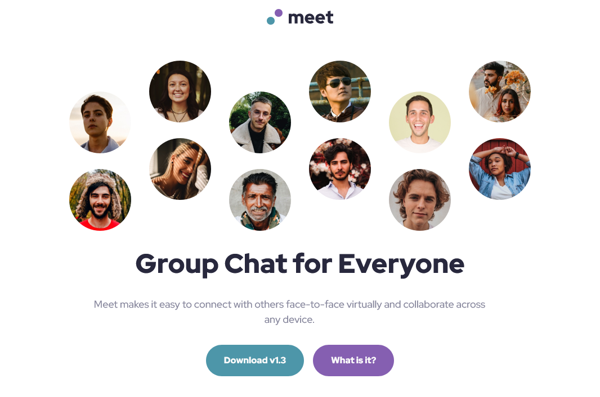

# Frontend Mentor - Meet landing page solution

This is a solution to the [Meet landing page challenge on Frontend Mentor](https://www.frontendmentor.io/challenges/meet-landing-page-rbTDS6OUR). Frontend Mentor challenges help you improve your coding skills by building realistic projects. 

## Table of contents

- [Overview](#overview)
  - [The challenge](#the-challenge)
  - [Screenshot](#screenshot)
  - [Links](#links)
- [My process](#my-process)
  - [Built with](#built-with)
  - [What I learned](#what-i-learned)
  - [Continued development](#continued-development)
  - [Useful resources](#useful-resources)
- [Author](#author)
- [Acknowledgments](#acknowledgments)

**Note: Delete this note and update the table of contents based on what sections you keep.**

## Overview

### The challenge

Users should be able to:

- View the optimal layout depending on their device's screen size
- See hover and focus states for interactive elements

### Screenshot

### Links

- <a href="https://github.com/gabei/Meet-Landing-Page__FEM">View code here.</a>
- <a href="https://gabei.github.io/Meet-Landing-Page__FEM/" target="_blank">View live site on GitHub Pages</a>

## My process

### Built with
- Semantic HTML5 markup
- CSS custom properties
- Grid
- Flexbox
- Mobile-first workflow

### What I learned
I played around with different ways of nesting styles using SCSS includes and mixins. I'm still trying to determine how I like to organize my styles so that they are easier to look at. They certainly still need to be refactored a bit.

### Continued development
I'm interested in learning how to simplify grid layouts. I feel that I am too hands on with how to make things wrap in particular ways, rather than creating a flexible layout from the start.

### Useful resources
<a href="https://www.photopea.com/" target="_blank">

- <a href="https://www.photopea.com/" target="_blank">PhotoPea</a> - This is a great in-browser Photoshop clone. Please allow ads on this site to support its creator!
- <a href="https://feathericons.com/" target="_blank">Feather Icons</a> - Easy to use icons for front end devlopment.

## Author
- Frontend Mentor - <a href="https://www.frontendmentor.io/profile/gabei" target="_blank">@gabei</a>
- Github - <a href="(https://www.github.com/gabei" target="_blank">@gabei</a>
